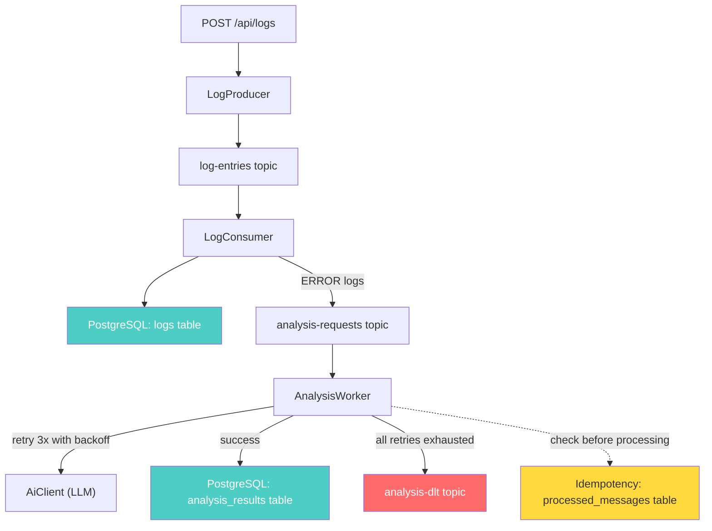

# 🔍 LogSage AI

**AI-Powered DevOps Incident Analyzer** — An event-driven system that ingests application logs via Kafka, identifies error patterns using LLM-based analysis, and returns structured incident reports with root cause and fix suggestions.

---

## 📋 Table of Contents

- [Problem Statement](#-problem-statement)
- [Architecture](#-architecture)
- [Features](#-features)
- [Tech Stack](#-tech-stack)
- [How It Works](#-how-it-works)
- [Setup Instructions](#-setup-instructions)
- [API Endpoints](#-api-endpoints)
- [Kafka Monitoring](#-kafka-monitoring)
- [Design Decisions](#-design-decisions)
- [Current Limitations](#-current-limitations)
- [Future Improvements](#-future-improvements)

---

## 🎯 Problem Statement

In microservice architectures, operations teams deal with **thousands of log lines** spread across dozens of services. Identifying the root cause of an incident requires:

1. Scanning logs manually across multiple services
2. Correlating error patterns across time windows
3. Understanding the technical context behind cryptic stack traces

**LogSage AI automates this.** It ingests logs, identifies errors, and uses an LLM to produce structured incident analysis — including error type, root cause, severity level, and an actionable fix suggestion.

---

## 🏗 Architecture

The system evolved through two phases, each building on the previous:

### Phase 1 — Synchronous REST API

Direct request-response cycle. Logs are submitted and analyzed in one HTTP call.

```
Client → POST /api/logs → LogService → InMemoryStore
Client → POST /api/analyze → AiClient → OpenAI → Response
```

**Limitation:** Log ingestion and AI analysis are coupled. Slow AI responses block the user.

### Phase 2 (Stage 2) — Event-Driven with Multi-Topic Pipeline

Kafka strictly decouples all components. The user gets an instant acknowledgment. Log storage happens instantly, and AI analysis is routed to a dedicated specialized worker.

### Phase 3 (Stage 3) — Fault-Tolerant, Production-Ready Pipeline

Added PostgreSQL persistence, idempotency, retry mechanisms, and a Dead Letter Topic (DLT) for complete reliability.



---

## ✅ Features

### Log Ingestion
- REST API accepts structured JSON logs (timestamp, service, level, message)
- Logs published to Kafka `log-entries` topic (keyed by service name)
- Immediate `202 Accepted` response — non-blocking ingestion

### AI-Powered Analysis
- ERROR-level logs are routed to an `analysis-requests` topic
- A dedicated `AnalysisWorker` limits concurrent AI requests to safely manage rate-limits
- Structured output: `error_type`, `root_cause`, `severity` (LOW/MEDIUM/HIGH), `fix_suggestion`
- Safe JSON parsing with markdown code block stripping
- Configurable connection and read timeouts (5s / 30s)

### Architecture & Reliability
- Strict Single-Responsibility Principle: `LogConsumer` only stores and routes, `AnalysisWorker` handles expensive AI calls
- Rate limiting (10 req/min per IP on `/analyze` fallback)
- **PostgreSQL Persistence**: Fully replaces in-memory stores using Spring Data JPA
- **Idempotency**: Prevents duplicate processing of logs using SHA-256 hashing
- Global exception handling (400, 429, 503 responses)
- Input validation with Jakarta Bean Validation
- Immutable DTOs using Java records

### Kafka Integration
- KRaft-mode Kafka via Docker (no Zookeeper dependency)
- Multi-topic architecture: `log-entries`, `analysis-requests`, and `analysis-dlt`
- **Fault Tolerance**: 3x exponential backoff retry for transient AI failures
- **Dead Letter Topic (DLT)**: Unresolvable messages are routed to `analysis-dlt` instead of being lost
- Consumer groups: isolated groups (`logsage-log-processors` and `logsage-ai-workers`)
- String serialization with manual JSON mapping (explicit, debuggable)
- Automatic topic creation

---

## 🛠 Tech Stack

| Layer | Technology |
|-------|-----------|
| Backend | Java 21, Spring Boot 4 |
| Frontend | React 18, Vite 5 |
| Messaging | Apache Kafka 3.9 (KRaft mode) |
| Database | PostgreSQL 16 |
| AI | OpenAI Chat Completions API (GPT-3.5 Turbo) |
| HTTP Client | Spring WebFlux WebClient |
| Containerization | Docker, Docker Compose |
| Monitoring | Kafbat UI |
| Build Tool | Maven |

---

## ⚡ How It Works

### Step-by-step flow

```
1. Client sends POST /api/logs with JSON array of log entries
2. LogController validates input → passes to LogProducer
3. LogProducer publishes each entry to Kafka [log-entries] topic
4. HTTP response returns immediately: 202 Accepted

   ─── async boundary 1 ───

5. LogConsumer picks up messages from [log-entries]
6. ALL logs are stored in PostgreSQL
7. Consumer checks log level:
   - INFO/WARN → skips further routing
   - ERROR → publishes to Kafka [analysis-requests] topic

   ─── async boundary 2 ───

8. AnalysisWorker picks up messages from [analysis-requests]
9. Idempotency check: hashes log entry and skips if already processed
10. Calls AiClient to send the ERROR log to OpenAI with DevOps expert system prompt
11. If AiClient fails, Spring Kafka retries 3x with exponential backoff. If all fail, routes to [analysis-dlt]
12. OpenAI returns structured JSON:
   {
     "error_type": "ConnectionRefusedException",
     "root_cause": "gateway timeout",
     "severity": "HIGH",
     "fix_suggestion": "Check the network connection to the payment gateway"
   }
13. Result stored in PostgreSQL alongside the idempotency marker
14. Client polls GET /api/results to retrieve analysis
```

---

## 🚀 Setup Instructions

### Prerequisites
- Java 21+
- Node.js 18+ (for frontend)
- Docker Desktop (for Kafka)

### 1. Start Kafka

```bash
cd "LogSage AI"
docker-compose up -d
```

Verify:
```bash
docker ps
# Should show: logsage-kafka with status "Up"
```

### 2. Start Backend

```bash
cd backend

# Set your OpenAI API key
# Linux/Mac:
export AI_API_KEY="sk-your-key-here"

# Windows PowerShell:
$env:AI_API_KEY = "sk-your-key-here"

# Run
./mvnw spring-boot:run
```

**Expected startup log:**
```
logsage-processors: partitions assigned: [log-entries-0]
logsage-ai-workers: partitions assigned: [analysis-requests-0]
```

### 3. Start Frontend (optional)

```bash
cd frontend
npm install
npm run dev
# Opens at http://localhost:5173
```

### Environment Variables

| Variable | Default | Description |
|----------|---------|-------------|
| `AI_API_KEY` | *(required)* | OpenAI API key |
| `AI_API_BASE_URL` | `https://api.openai.com/v1` | LLM API base URL |
| `AI_API_MODEL` | `gpt-3.5-turbo` | Model to use |
| `KAFKA_BOOTSTRAP_SERVERS` | `localhost:9092` | Kafka broker address |
| `LOG_STORE_MAX_CAPACITY` | `10000` | Max log entries in memory |
| `RATE_LIMIT_REQUESTS` | `10` | Max analysis requests per minute per IP |

---

## 📡 API Endpoints

### `POST /api/logs` — Ingest Logs

Publishes log entries to Kafka for async processing.

**Request:**
```json
[
  {
    "timestamp": "2026-04-28T02:00:00Z",
    "service": "auth-service",
    "level": "ERROR",
    "message": "NullPointerException in UserService.java:42 — token is null"
  }
]
```

**Response:** `202 Accepted`
```json
{
  "message": "Logs queued for processing",
  "count": 1
}
```

### `POST /api/analyze` — Synchronous Analysis (Phase 1 fallback)

Sends logs directly to AI for immediate analysis.

**Request:**
```json
{
  "logs": [
    {
      "timestamp": "2026-04-28T02:00:00Z",
      "service": "auth-service",
      "level": "ERROR",
      "message": "NullPointerException in UserService.java:42"
    }
  ]
}
```

**Response:** `200 OK`
```json
{
  "error_type": "NullPointerException",
  "root_cause": "token is null",
  "severity": "HIGH",
  "fix_suggestion": "Add null check before token usage in UserService.java:42"
}
```

### `GET /api/results` — Query Analysis Results

Returns AI analysis results from the Kafka consumer pipeline.

**Query params:** `?service=auth-service` (optional filter)

**Response:** `200 OK`
```json
[
  {
    "service": "auth-service",
    "response": {
      "error_type": "NullPointerException",
      "root_cause": "token is null",
      "severity": "HIGH",
      "fix_suggestion": "Add null check before token usage"
    },
    "analyzedAt": "2026-04-28T02:54:39"
  }
]
```

### Error Responses

| Status | When |
|--------|------|
| `400` | Invalid input or malformed JSON |
| `429` | Rate limit exceeded (analysis endpoint) |
| `503` | AI service unavailable or analysis queue full |

---

## 📊 Kafka Monitoring

Use **Kafbat UI** to inspect messages, consumer groups, and topic health:

```bash
docker run -d -p 8080:8080 \
  -e DYNAMIC_CONFIG_ENABLED=true \
  -e KAFKA_CLUSTERS_0_NAME=logsage \
  -e KAFKA_CLUSTERS_0_BOOTSTRAP_SERVERS=host.docker.internal:9092 \
  ghcr.io/kafbat/kafka-ui
```

Open `http://localhost:8080` to:
- View messages in `log-entries` and `analysis-requests` topics
- Monitor consumer groups `logsage-processors` and `logsage-ai-workers` lag
- Check partition offsets

---

## 🧠 Design Decisions

### Why separate LogConsumer and AnalysisWorker? (Stage 2)
In Stage 1, a single consumer handled DB writes and slow AI calls. If OpenAI's API was slow, it halted log ingestion completely.
By moving AI calls to a separate `AnalysisWorker` listening on a dedicated topic (`analysis-requests`), log storage remains lightning-fast, and the AI workers can scale horizontally entirely independent of ingestion logic. Focus on Single-Responsibility.

### Why Kafka?
Log ingestion should be fast and non-blocking. AI analysis takes 5–30 seconds per call. Without Kafka, each log submission would wait for the AI response. Kafka decouples these — the producer returns instantly, and the consumer processes at its own pace.

### Why structured AI output?
Free-text AI responses are hard to display and impossible to aggregate. By constraining the LLM to return a fixed JSON schema (`error_type`, `root_cause`, `severity`, `fix_suggestion`), we can:
- Display results in a consistent UI
- Filter/sort by severity
- Build dashboards over time

### Why in-memory storage?
Phase 1/2 scope decision. A database adds deployment complexity. Bounded in-memory stores with LRU eviction are sufficient for development and demos. PostgreSQL is planned for Phase 3.

---

## ⚠️ Current Limitations

| Limitation | Impact | Planned Fix |
|-----------|--------|-------------|
| No authentication | API is open | Spring Security + JWT |
| Single partitions | Limited overall throughput | Increase partitions + parallel scaling |
| Polling for results | Client must poll GET /api/results | WebSocket push notifications |

---

## 🔮 Future Improvements

- **Redis caching** — Cache recent analysis results to reduce duplicate AI calls
- **WebSocket result delivery** — Push analysis results to the UI in real-time instead of polling
- **Multi-agent AI analysis** — Specialized agents for different error categories (DB errors, auth failures, infra issues)
- **Containerized deployment** — Dockerfile + docker-compose for the full stack (Kafka + Backend + Frontend)
- **Alerting** — Trigger notifications (Slack, email) for HIGH severity incidents
- **Log correlation** — Group related logs across services using trace IDs

---

## 📁 Project Structure

```
LogSage AI/
├── docker-compose.yml              # Kafka (KRaft mode)
├── backend/
│   └── src/main/java/com/logsage/backend/
│       ├── BackendApplication.java
│       ├── client/
│       │   ├── AiClient.java              # LLM API integration
│       │   └── PromptBuilder.java         # Prompt construction
│       ├── config/
│       │   ├── AiProperties.java          # @ConfigurationProperties
│       │   ├── AsyncConfig.java           # Bounded AI thread pool
│       │   ├── CorsConfig.java
│       │   ├── JacksonConfig.java
│       │   ├── KafkaConsumerConfig.java   # Retry + DLT error handling
│       │   ├── KafkaTopicConfig.java      # Topic auto-creation
│       │   └── WebClientConfig.java       # HTTP client + timeouts
│       ├── controller/
│       │   ├── AnalysisController.java    # POST /api/analyze (sync)
│       │   ├── LogController.java         # POST /api/logs (Kafka)
│       │   └── ResultController.java      # GET /api/results
│       ├── dto/
│       │   ├── AnalysisRequest.java
│       │   ├── AnalysisResponse.java      # Java record (immutable)
│       │   ├── ApiErrorResponse.java      # Java record
│       │   ├── LogEntry.java
│       │   ├── LogIngestionResponse.java  # Java record
│       │   └── LogLevel.java
│       ├── entity/
│       │   ├── AnalysisResultEntity.java  # JPA entity
│       │   ├── LogEntryEntity.java        # JPA entity
│       │   └── ProcessedMessageEntity.java# Idempotency marker
│       ├── exception/
│       │   ├── AiAnalysisException.java
│       │   ├── GlobalExceptionHandler.java
│       │   └── RateLimitExceededException.java
│       ├── filter/
│       │   └── RateLimitFilter.java       # Per-IP rate limiting
│       ├── kafka/
│       │   ├── AnalysisWorker.java        # Analyzes via 'analysis-requests'
│       │   ├── LogConsumer.java           # Consumes logs + routes to worker
│       │   └── LogProducer.java           # Publishes to Kafka
│       ├── repository/
│       │   ├── AnalysisResultRepository.java
│       │   ├── LogEntryRepository.java
│       │   └── ProcessedMessageRepository.java
│       └── service/
│           ├── AnalysisService.java       # @Async analysis orchestration
│           └── LogService.java
└── frontend/
    └── src/
        ├── App.jsx
        ├── components/
        │   ├── AnalysisResult.jsx
        │   └── LogInput.jsx
        └── index.css
```

---

## 📄 License

This project is for educational and portfolio purposes.
