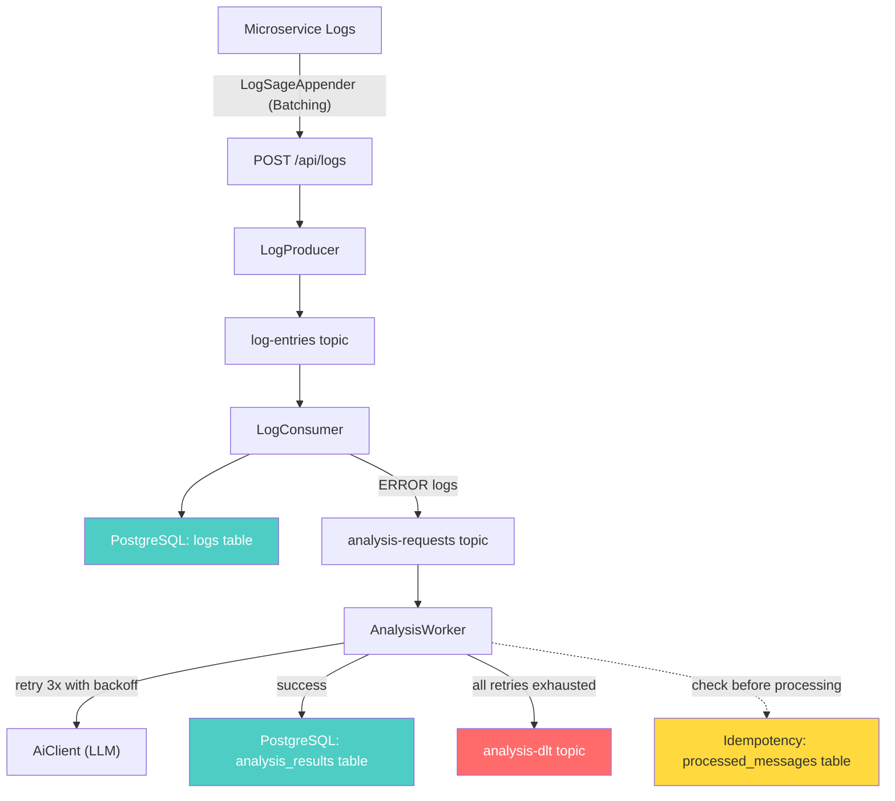
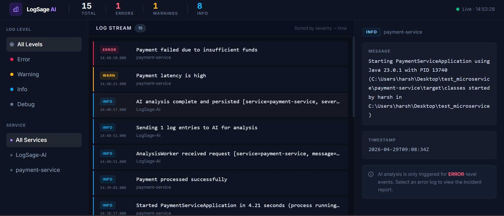
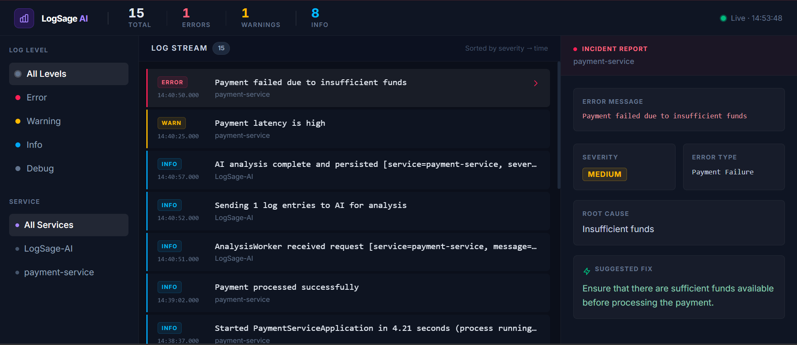
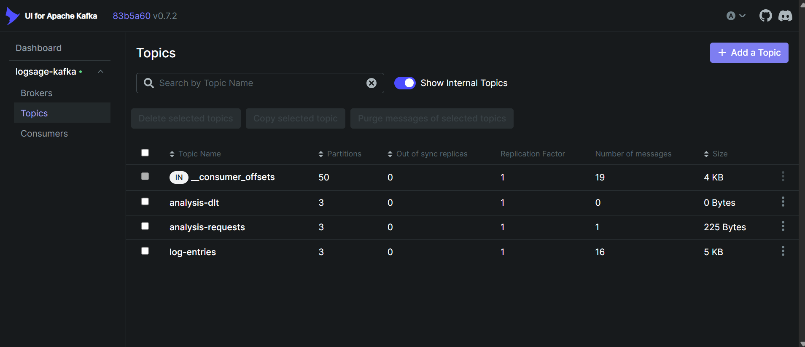

# 🔍 LogSage AI

**AI-Powered DevOps Incident Analyzer** — An event-driven observability platform that ingests application logs via a custom batching appender and Kafka, identifies error patterns using LLM-based analysis, and displays structured incident reports with root cause and fix suggestions on a modern dark-themed dashboard.

---

## 📋 Table of Contents

- [Problem Statement](#-problem-statement)
- [Architecture](#-architecture)
- [Features](#-features)
- [Tech Stack](#-tech-stack)
- [How It Works](#-how-it-works)
- [Setup Instructions](#-setup-instructions)
- [API Endpoints](#-api-endpoints)
- [Kafka Monitoring](#-kafka-monitoring)
- [Design Decisions](#-design-decisions)
- [Future Improvements](#-future-improvements)

---

## 🎯 Problem Statement

In microservice architectures, operations teams deal with **thousands of log lines** spread across dozens of services. Identifying the root cause of an incident requires:

1. Scanning logs manually across multiple services
2. Correlating error patterns across time windows
3. Understanding the technical context behind cryptic stack traces

**LogSage AI automates this.** It provides a zero-friction logging integration (via a custom Logback Appender), ingests logs seamlessly, identifies errors, and uses an LLM to produce structured incident analysis — including error type, root cause, severity level, and actionable fix suggestions.

---

## 🏗 Architecture

The system evolved into a robust, event-driven pipeline:

### 1. Ingestion via Custom LogSageAppender
A high-performance Logback Appender intercepts microservice logs, batches them in-memory using an `ArrayBlockingQueue`, and flushes them to the ingestion endpoint via Java Virtual Threads to ensure the primary application is never blocked.

### 2. Event-Driven with Multi-Topic Pipeline
Kafka strictly decouples all components. Log storage happens instantly, and AI analysis is routed to a dedicated specialized worker.

### 3. Fault-Tolerant, Production-Ready Pipeline
Includes PostgreSQL persistence, idempotency, retry mechanisms, parallel processing (3 partitions), and a Dead Letter Topic (DLT) for complete reliability and horizontal scalability.



---

## ✅ Features

### 📊 Modern Observability Dashboard
- Datadog-style, dark-themed UI built with React and Tailwind CSS.
- Real-time hierarchical views including a Metrics Bar, Filters, Log Stream, and dedicated Analysis Panel.
- Interactive filtering by service and severity level.

### 🚀 High-Performance Log Ingestion
- **Custom Logback Appender:** Captures logs directly from Java applications, batches them in memory, and flushes asynchronously using Virtual Threads and a `ScheduledExecutorService`.
- REST API accepts batched JSON logs for rapid ingestion.
- Immediate `202 Accepted` response — entirely non-blocking.

### 🧠 AI-Powered Analysis
- ERROR-level logs are routed to an `analysis-requests` topic.
- A dedicated `AnalysisWorker` limits concurrent AI requests to safely manage API rate-limits.
- Structured output: `error_type`, `root_cause`, `severity` (LOW/MEDIUM/HIGH), `fix_suggestion`.

### 🏗 Architecture & Reliability
- **PostgreSQL Persistence**: Robust relational mapping for logs and analysis results.
- **Idempotency**: Prevents duplicate processing of logs using SHA-256 hashing.
- Global exception handling and strict Single-Responsibility Principle across workers.

### ⚡ Kafka Integration
- KRaft-mode Kafka via Docker (no Zookeeper dependency).
- Multi-topic architecture: `log-entries`, `analysis-requests`, and `analysis-dlt`.
- **Fault Tolerance**: 3x exponential backoff retry for transient AI failures.
- **Parallel & Ordered Processing**: Partition keys guarantee that logs from the same service are processed sequentially across 3 dynamically distributed partitions.

---

## 🛠 Tech Stack

| Layer | Technology |
|-------|-----------|
| Backend | Java 21, Spring Boot 3.x |
| Frontend | React 18, Vite 5, Tailwind CSS |
| Messaging | Apache Kafka 3.9 (KRaft mode) |
| Database | PostgreSQL 16 |
| AI | OpenAI Chat Completions API (GPT-3.5 Turbo) |
| Concurrency | Java Virtual Threads, ArrayBlockingQueue |
| Containerization | Docker, Docker Compose |
| Monitoring | Kafbat UI |

---

## ⚡ How It Works

### Step-by-step flow

```
1. Microservice emits a log -> Caught by LogSageAppender
2. Appender batches logs and sends async HTTP POST to /api/logs
3. LogController validates input → passes to LogProducer
4. LogProducer publishes each entry to Kafka [log-entries] topic
5. HTTP response returns immediately: 202 Accepted

   ─── async boundary 1 ───

6. LogConsumer picks up messages from [log-entries]
7. ALL logs are stored in PostgreSQL
8. Consumer checks log level:
   - INFO/WARN → skips further routing
   - ERROR → publishes to Kafka [analysis-requests] topic

   ─── async boundary 2 ───

9. AnalysisWorker picks up messages from [analysis-requests]
10. Idempotency check: hashes log entry and skips if already processed
11. Calls AiClient to send the ERROR log to OpenAI with DevOps expert system prompt
12. If AiClient fails, Spring Kafka retries 3x with exponential backoff.
13. OpenAI returns structured JSON root cause and fix suggestions.
14. Result stored in PostgreSQL alongside the idempotency marker.
15. Frontend Dashboard polls GET /api/results and displays actionable reports.
```

---

## 🚀 Setup Instructions

### Prerequisites
- Java 21+
- Node.js 18+ (for frontend)
- Docker Desktop (for Kafka & PostgreSQL)

### 1. Start Infrastructure (Kafka & PostgreSQL)

```bash
docker-compose up -d
```

Verify:
```bash
docker ps
# Should show: logsage-kafka, logsage-postgres, and logsage-kafka-ui with status "Up"
```

### 2. Start Backend

```bash
cd backend

# Set your OpenAI API key
# Linux/Mac:
export AI_API_KEY="sk-your-key-here"

# Windows PowerShell:
$env:AI_API_KEY = "sk-your-key-here"

# Run
./mvnw clean spring-boot:run
```

### 3. Start Frontend

```bash
cd frontend
npm install
npm run dev
# Opens at http://localhost:5173
```

## 🔌 Microservice Integration

LogSage is designed to work seamlessly across multiple microservices using a custom Logback appender.

### 📦 Steps to Integrate with Any Spring Boot Service

1. Copy the following files into your microservice:
   - `LogSageAppender.java`
   - `logback-spring.xml`

2. Configure your `application.yml`:

```yaml
spring:
  application:
    name: payment-service   # unique per service

logsage:
  appender:
    url: http://localhost:8081/api/logs
```
⚠️ Critical Configuration Note (Common Pitfall)

Logback only forwards logs for specific package scopes.

If your logback-spring.xml contains:

<logger name="com.logsage" ...>

👉 Then ONLY logs from com.logsage.* will be forwarded.

To forward all your microservice logs, change the logger to:
```
<logger name="com.yourcompany" level="DEBUG" additivity="false">
</logger>
```

✅ Solution

Update the logger scope:

```
<logger name="com" level="DEBUG" additivity="false">
    <appender-ref ref="CONSOLE"/>
    <appender-ref ref="LOGSAGE"/>
</logger>
```

👉 This ensures ALL application logs from all services are captured.


### Environment Variables

| Variable | Default | Description |
|----------|---------|-------------|
| `AI_API_KEY` | *(required)* | OpenAI API key |
| `AI_API_BASE_URL` | `https://api.openai.com/v1` | LLM API base URL |
| `AI_API_MODEL` | `gpt-3.5-turbo` | Model to use |
| `KAFKA_BOOTSTRAP_SERVERS` | `localhost:9092` | Kafka broker address |
| `POSTGRES_HOST` | `localhost` | PostgreSQL host |
| `POSTGRES_USER` | `logsage` | PostgreSQL user |
| `POSTGRES_PASSWORD` | `logsage` | PostgreSQL password |

---

## 📡 API Endpoints

### `POST /api/logs` — Ingest Logs
Publishes log entries to Kafka for async processing. (Usually called automatically by LogSageAppender).

### `POST /api/analyze` — Synchronous Analysis (Fallback)
Sends logs directly to AI for immediate, blocking analysis.

### `GET /api/results` — Query Analysis Results
Returns AI analysis results from the database.

---

## 📊 Kafka Monitoring

Use **Kafbat UI** to inspect messages, consumer groups, and topic health. It runs on `http://localhost:8080` (configured via `docker-compose.yml`).

---

## 🧠 Design Decisions

### Why a Custom Logback Appender?
Logging should never crash or slow down the host application. The `LogSageAppender` uses an `ArrayBlockingQueue` to safely batch logs. It drops logs if the queue overflows (preventing Out-Of-Memory errors) and flushes them using lightweight Virtual Threads, ensuring high throughput with near-zero overhead.

### Why separate LogConsumer and AnalysisWorker?
If OpenAI's API is slow, it shouldn't halt log ingestion. By moving AI calls to a separate `AnalysisWorker` listening on a dedicated topic (`analysis-requests`), log storage remains lightning-fast, and the AI workers can scale horizontally entirely independent of ingestion logic. 

### Why structured AI output?
Free-text AI responses are hard to display and impossible to aggregate. By constraining the LLM to return a fixed JSON schema (`error_type`, `root_cause`, `severity`, `fix_suggestion`), we can display results in a consistent, professional Datadog-style UI.

---

## 🔮 Future Improvements

- **WebSocket result delivery** — Push analysis results to the UI in real-time instead of polling.
- **Multi-agent AI analysis** — Specialized agents for different error categories (DB errors, auth failures, infra issues).
- **Alerting** — Trigger notifications (Slack, email) for HIGH severity incidents.

---

## 📁 Project Structure

```
LogSage AI/
├── docker-compose.yml              # Kafka (KRaft) & PostgreSQL
├── backend/
│   └── src/main/java/com/logsage/backend/
│       ├── client/                 # AiClient, PromptBuilder
│       ├── config/                 # AsyncConfig, KafkaConfig, AiProperties
│       ├── controller/             # LogController, ResultController
│       ├── dto/                    # Immutable Java records
│       ├── entity/                 # JPA Entities (PostgreSQL)
│       ├── exception/              # GlobalExceptionHandler
│       ├── kafka/                  # LogProducer, LogConsumer, AnalysisWorker
│       ├── logging/                # Custom LogSageAppender (Batching)
│       ├── repository/             # Spring Data JPA Repositories
│       └── service/                # Business Logic
└── frontend/
    └── src/
        ├── App.jsx
        ├── components/
        │   ├── DashboardPage.jsx   # Main Dark-Themed UI
        │   ├── LogsList.jsx        # Virtualized Log Stream
        │   ├── AnalysisPanel.jsx   # AI Incident Reports
        │   └── FiltersPanel.jsx    # Sidebar filtering
        └── index.css               # Tailwind & Custom Styles
```

---
## 📸 Screenshots

### 🖥️ Dashboard


---

### 🤖 AI Analysis


---

---

### 📊 Kafka UI


---

## 📄 License

This project is for educational and portfolio purposes.
