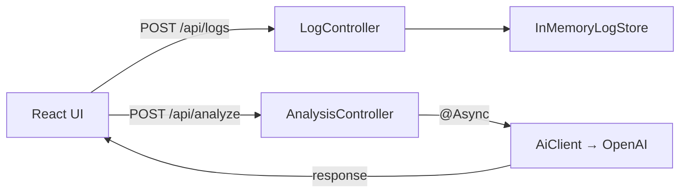
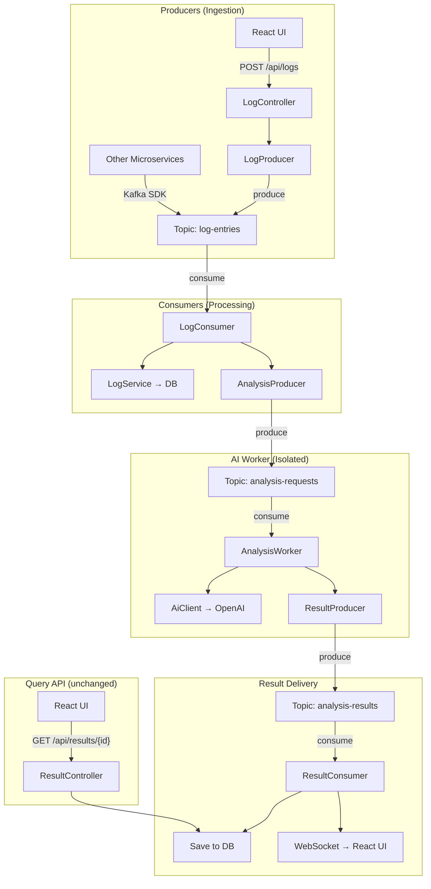
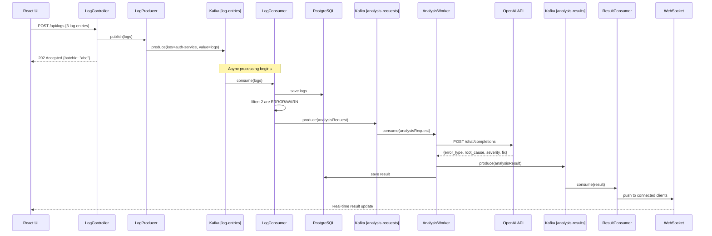
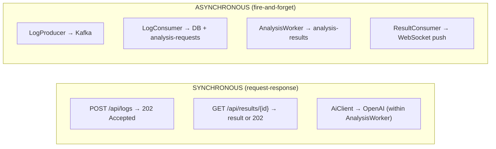

# Phase 2 Architecture — Kafka Integration

## 1. Where Kafka Fits in the Current Architecture

### Current (Phase 1) — Synchronous, Request-Response



**Problems this creates at scale:**
- Log ingestion and analysis are **tightly coupled** to HTTP request lifecycle
- If AiClient is slow, frontend waits (even with @Async, it's still request-scoped)
- No replay capability — if analysis fails, the log data must be re-submitted
- No way for **other services** to publish logs (only through REST API)
- No buffering — traffic spike = direct pressure on AI service

### Proposed (Phase 2) — Kafka as the Backbone



**Kafka gives us:**
| Benefit | What it solves |
|---------|---------------|
| **Decoupling** | Log ingestion doesn't depend on AI availability |
| **Buffering** | Traffic spikes are absorbed by Kafka partitions |
| **Replay** | Failed analysis can be retried from the topic |
| **Multi-producer** | Any microservice can publish logs via Kafka SDK |
| **Ordering** | Logs per service are ordered within a partition |
| **Backpressure** | Consumer processes at its own pace |

---

## 2. What Changes in Existing APIs

### `POST /api/logs` — Becomes a Producer

| Aspect | Phase 1 | Phase 2 |
|--------|---------|---------|
| What it does | Stores logs in memory | Publishes to `log-entries` topic |
| Response | 201 + count | 202 Accepted + `batchId` |
| Blocking? | Yes (store is fast) | No (Kafka send is async with callback) |
| Response time | ~1ms | ~5ms (Kafka ack) |

```
POST /api/logs → LogController → LogProducer → Kafka [log-entries]
Response: { "batchId": "uuid", "status": "ACCEPTED", "count": 3 }
```

> [!IMPORTANT]
> The response changes from **201 Created** to **202 Accepted** — this signals to the client that the logs are accepted but not yet processed. This is a breaking API change.

### `POST /api/analyze` — Two Options

**Option A: Remove entirely (recommended)**

Analysis becomes **automatic**. When logs are consumed from `log-entries`, the consumer decides which logs need analysis (e.g., ERROR/WARN levels) and publishes them to `analysis-requests`. No explicit "analyze" call needed.

**Option B: Keep as a trigger**

If you still want manual analysis, keep the endpoint but change it to:
```
POST /api/analyze → publishes to [analysis-requests] topic
Response: { "analysisId": "uuid", "status": "QUEUED" }
```

Then add a polling/WebSocket endpoint for results:
```
GET /api/results/{analysisId} → returns result when ready (or 202 if still processing)
```

**My recommendation: Option A** — it's simpler and matches the event-driven paradigm. The only reason to keep `/analyze` is if you want on-demand analysis of already-stored logs.

### New Endpoints

| Endpoint | Purpose |
|----------|---------|
| `GET /api/results?service=auth-service` | Query analysis results from DB |
| `GET /api/results/{analysisId}` | Get a specific analysis result |
| `WebSocket /ws/results` | Real-time result push to UI |

---

## 3. Components Needed

### 3.1 — Kafka Topics (3)

| Topic | Key | Value | Partitions | Retention |
|-------|-----|-------|------------|-----------|
| `log-entries` | `service` name | `LogEntry` JSON | 6 | 7 days |
| `analysis-requests` | `batchId` | `List<LogEntry>` JSON | 3 | 3 days |
| `analysis-results` | `analysisId` | `AnalysisResponse` JSON | 3 | 30 days |

**Partitioning strategy**: Key by `service` name for `log-entries` — this ensures all logs from the same microservice go to the same partition, maintaining order per service.

### 3.2 — Producers (2)

**LogProducer**
- Called by: `LogController`
- Publishes to: `log-entries`
- Behavior: Fire-and-forget with callback (log failures, don't block request)
- Lives in: `producer/LogProducer.java`

**AnalysisRequestProducer**
- Called by: `LogConsumer` (after filtering for ERROR/WARN)
- Publishes to: `analysis-requests`
- Behavior: Synchronous send (we want to guarantee the analysis request is queued)
- Lives in: `producer/AnalysisRequestProducer.java`

### 3.3 — Consumers (2)

**LogConsumer**
- Listens to: `log-entries`
- Does: 
  1. Saves log to database (PostgreSQL)
  2. If log level is ERROR or WARN → publishes to `analysis-requests`
- Consumer group: `logsage-log-processors`
- Concurrency: 3 threads (matches partitions)

**AnalysisWorker**
- Listens to: `analysis-requests`
- Does:
  1. Calls `AiClient.analyze()` (the **existing** code — unchanged)
  2. Publishes result to `analysis-results`
  3. Saves result to database
- Consumer group: `logsage-ai-workers`
- Concurrency: 2 threads (limited by AI API rate)
- **Key design decision**: This is where the slow AI call happens. Kafka naturally provides backpressure — if the consumer is slow, messages queue up in the topic instead of crashing the app.

### 3.4 — Processing Service (1)

**ResultConsumer**
- Listens to: `analysis-results`
- Does:
  1. Saves to database (if not already saved by AnalysisWorker)
  2. Pushes to connected WebSocket clients
- Consumer group: `logsage-result-handlers`

### 3.5 — What stays from Phase 1 (Reused as-is)

| Component | Status | Why |
|-----------|--------|-----|
| `AiClient` | ✅ Unchanged | HTTP call to LLM — Kafka doesn't affect this |
| `PromptBuilder` | ✅ Unchanged | Prompt logic is independent |
| `AiProperties` | ✅ Unchanged | Config is config |
| `WebClientConfig` | ✅ Unchanged | HTTP client config |
| `GlobalExceptionHandler` | ✅ Extended | Add Kafka-specific exceptions |
| `DTOs` | ✅ Extended | Add `batchId`, `analysisId` fields |

---

## 4. End-to-End Data Flow

### Happy Path: Log Ingestion → Auto-Analysis → Result



### Manual Query (Polling fallback)

```
UI → GET /api/results/abc → ResultController → DB → response
```

---

## 5. Synchronous vs Asynchronous Boundaries



| Operation | Sync/Async | Why |
|-----------|-----------|-----|
| `POST /api/logs` | **Sync** (fast) | Kafka produce is fast (~5ms). Client gets immediate ack. |
| Log → DB storage | **Async** | Consumer processes at own pace |
| Log → Analysis decision | **Async** | Consumer filters and publishes |
| AI analysis | **Async** | Slowest part (5-30s). Must not block anything else. |
| Result → DB | **Async** | Worker saves after AI response |
| Result → UI | **Async** | WebSocket push when ready |
| `GET /api/results/{id}` | **Sync** | Simple DB query |

---

## 6. Failure Scenarios

### F1: Kafka Broker Down

| Impact | Mitigation |
|--------|------------|
| `POST /api/logs` fails (producer can't connect) | Return HTTP 503 with retry hint. Frontend shows "Service temporarily unavailable" |
| No messages consumed | Consumers idle until broker recovers. No data loss — messages are persisted on disk |
| **Key decision**: Should `/api/logs` have a **fallback** to direct DB write? | For Phase 2: No. Keep it simple. If Kafka is down, the system is degraded. Acceptable for MVP. |

### F2: LogConsumer Crashes

| Impact | Mitigation |
|--------|------------|
| Messages queue up in `log-entries` | Kafka retains messages per retention policy (7 days) |
| Backlog builds | Consumer resumes from **last committed offset** when restarted |
| No data loss | Kafka guarantees at-least-once delivery |

### F3: AnalysisWorker Crashes Mid-Analysis

| Impact | Mitigation |
|--------|------------|
| AI call may have completed but result not published | Worker should commit offset **after** publishing result (at-least-once) |
| Duplicate analysis possible | Acceptable — same logs analyzed twice produce same result (idempotent LLM calls with `temperature: 0`) |
| **Key decision**: Use manual offset commit, not auto-commit | Ensures we only commit after successful processing |

### F4: OpenAI API Down (LLM unavailable)

| Impact | Mitigation |
|--------|------------|
| AnalysisWorker gets connection timeout or 5xx error | **Don't commit offset**. Kafka will redeliver the message. |
| Repeated failures | Add exponential backoff with max retries (e.g., 3 retries with 5s/15s/45s delays) |
| After max retries | Publish to a `dead-letter-topic` for manual investigation |
| **Why this is better than Phase 1** | In Phase 1, failure = instant 503 to user. In Phase 2, the message waits in Kafka until AI recovers. |

### F5: Database Down

| Impact | Mitigation |
|--------|------------|
| LogConsumer can't save logs | Don't commit offset → Kafka retries |
| AnalysisWorker can't save results | Same — don't commit, message replays |
| API queries fail | Return 503. Results are still in Kafka topics (can be reprocessed). |

### F6: Message Serialization Error (Poison Pill)

| Impact | Mitigation |
|--------|------------|
| Consumer can't deserialize a message | Log the raw message, skip it, commit offset |
| Continuous failure on same message | Without skip logic, consumer is stuck forever |
| **Solution** | `ErrorHandler` with `DeadLetterPublishingRecoverer` — sends bad messages to a DLT topic |

---

## 7. Minimal Design — Implementation Plan

> [!TIP]
> The principle: **Add Kafka only where it provides clear value.** Don't Kafka-fy everything.

### Step 1: Add Kafka for Log Ingestion Only

```
POST /api/logs → LogProducer → Kafka [log-entries] → LogConsumer → PostgreSQL
POST /api/analyze → (keep Phase 1 sync flow, reads from DB)
```

**Why start here**: This gives you decoupled ingestion, buffering, and multi-producer support without touching the analysis flow. Lowest risk, highest impact.

### Step 2: Move Analysis to Kafka

```
LogConsumer → filters ERROR/WARN → Kafka [analysis-requests] → AnalysisWorker → AiClient → DB
```

**Why second**: The analysis flow is the slow part. Moving it to Kafka means AI slowness no longer affects any HTTP endpoint. The `/api/analyze` endpoint becomes optional.

### Step 3: Add Real-Time Result Delivery

```
AnalysisWorker → Kafka [analysis-results] → ResultConsumer → WebSocket → React UI
```

**Why last**: This is the "nice to have" for UX. Polling works fine as a fallback.

---

### Dependencies to Add (pom.xml)

| Dependency | Purpose |
|------------|---------|
| `spring-kafka` | Kafka producer/consumer |
| `spring-boot-starter-data-jpa` + `postgresql` | Persistent storage |
| `spring-boot-starter-websocket` | Real-time result push |

### Infrastructure Needed

| Component | Local Dev | Production |
|-----------|-----------|------------|
| Kafka | Docker: `confluentinc/cp-kafka` | Managed (AWS MSK, Confluent Cloud) |
| Zookeeper | Docker: `confluentinc/cp-zookeeper` | Included with managed Kafka (or KRaft mode) |
| PostgreSQL | Docker: `postgres:16` | Managed (RDS, Cloud SQL) |

### docker-compose addition:

```yaml
kafka:
  image: confluentinc/cp-kafka:7.6.0
  ports: ["9092:9092"]

postgres:
  image: postgres:16
  ports: ["5432:5432"]
  environment:
    POSTGRES_DB: logsage
    POSTGRES_USER: logsage
    POSTGRES_PASSWORD: logsage
```

---

## Decision Summary

| Decision | Choice | Rationale |
|----------|--------|-----------|
| Number of topics | 3 | Clean separation of concerns |
| Partition key | Service name | Orders logs per service |
| Offset commit | Manual | At-least-once delivery guarantee |
| Analysis trigger | Automatic on ERROR/WARN | Reduces API surface, event-driven |
| Result delivery | WebSocket + polling fallback | Real-time UX with reliability |
| Dead letter topic | Yes | Prevents poison pills from blocking consumers |
| Kafka in Phase 2 scope | Ingestion + analysis | No overkill — add more later if needed |
