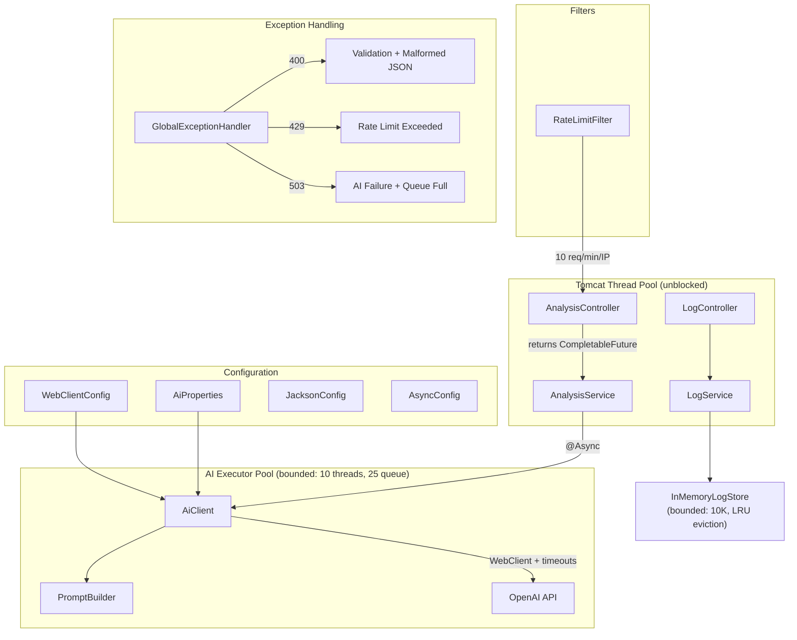
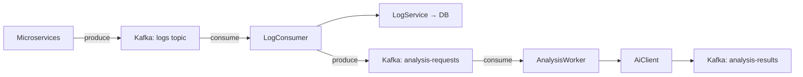

# Code Review Fixes — Complete Walkthrough

## Summary

Implemented **10 fixes** across 3 categories: 4 critical, 3 design, 3 scalability. The backend went from 16 to 23 source files. All changes compile and run successfully.

---

## Updated Architecture



---

## Fix-by-Fix Breakdown

### Fix 1: WebClient Timeouts 🔴 CRITICAL

**Before**: Zero timeouts. Unresponsive LLM = thread hangs forever.

**After**: Three layers of defense:

| Layer | Timeout | Purpose |
|-------|---------|---------|
| Netty `CONNECT_TIMEOUT_MILLIS` | 5s | Fail fast if LLM server unreachable |
| Netty `responseTimeout` | 30s | Abort if LLM takes too long responding |
| `Mono.timeout()` + `.block(Duration)` | 30s/31s | Defense-in-depth on the reactive chain |

**Files changed**: [WebClientConfig.java](file:///c:/Users/harsh/Desktop/LogSage%20AI/backend/src/main/java/com/logsage/backend/config/WebClientConfig.java) (NEW), [AiClient.java](file:///c:/Users/harsh/Desktop/LogSage%20AI/backend/src/main/java/com/logsage/backend/client/AiClient.java)

---

### Fix 2: Blocking Call Isolation 🔴 CRITICAL

**Before**: `WebClient.block()` ran on Tomcat request threads. 200 concurrent AI requests = all threads exhausted = app dead.

**After**: `@Async("aiExecutor")` runs AI calls on a dedicated bounded pool.

```diff
-public AnalysisResponse analyzeLogs(List<LogEntry> logs) {
-    AnalysisResponse response = aiClient.analyze(logs);
-    return response;
+@Async("aiExecutor")
+public CompletableFuture<AnalysisResponse> analyzeLogs(List<LogEntry> logs) {
+    AnalysisResponse response = aiClient.analyze(logs);
+    return CompletableFuture.completedFuture(response);
 }
```

| Config | Value | Rationale |
|--------|-------|-----------|
| Core pool | 5 | Handles normal load |
| Max pool | 10 | Burst capacity |
| Queue | 25 | Buffer before rejection |
| Rejection | RejectedExecutionException → 503 | Clear error, not silent hang |

**Files changed**: [AsyncConfig.java](file:///c:/Users/harsh/Desktop/LogSage%20AI/backend/src/main/java/com/logsage/backend/config/AsyncConfig.java) (NEW), [AnalysisService.java](file:///c:/Users/harsh/Desktop/LogSage%20AI/backend/src/main/java/com/logsage/backend/service/AnalysisService.java), [AnalysisController.java](file:///c:/Users/harsh/Desktop/LogSage%20AI/backend/src/main/java/com/logsage/backend/controller/AnalysisController.java)

---

### Fix 3: No Silent Error Swallowing 🔴 CRITICAL

**Before**: Parse failures returned a fake `AnalysisResponse` with `errorType="PARSE_ERROR"` and HTTP 200. Client thought analysis succeeded.

**After**: Parse failures throw `AiAnalysisException` → `GlobalExceptionHandler` returns HTTP 503 with error details.

```diff
 } catch (Exception e) {
-    return AnalysisResponse.builder()
-            .errorType("PARSE_ERROR")
-            .rootCause("AI response could not be parsed")
-            .severity("MEDIUM")
-            .fixSuggestion("Try again")
-            .build();
+    throw new AiAnalysisException("AI returned unparseable response: " + e.getMessage(), e);
 }
```

**Files changed**: [AiClient.java](file:///c:/Users/harsh/Desktop/LogSage%20AI/backend/src/main/java/com/logsage/backend/client/AiClient.java)

---

### Fix 4: API Key Security 🔴 CRITICAL

**Before**: Key hardcoded in `application.yml`.

**After**: Empty default — app won't start without env var set.

```diff
-key: sk-proj-W_qFIV...  # HARDCODED!
+key: ${AI_API_KEY:}      # Must be set via environment
```

Plus `@Validated` on `AiProperties` with `@NotBlank` — fails at startup if missing.

**Files changed**: [application.yml](file:///c:/Users/harsh/Desktop/LogSage%20AI/backend/src/main/resources/application.yml), [AiProperties.java](file:///c:/Users/harsh/Desktop/LogSage%20AI/backend/src/main/java/com/logsage/backend/config/AiProperties.java) (NEW)

---

### Fix 5: Single Responsibility Config 🟡 DESIGN

**Before**: `AiClientConfig` held WebClient bean + AI config values + ObjectMapper bean (3 responsibilities).

**After**: Split into 4 focused classes:

| Class | Responsibility |
|-------|---------------|
| [AiProperties](file:///c:/Users/harsh/Desktop/LogSage%20AI/backend/src/main/java/com/logsage/backend/config/AiProperties.java) | Type-safe config values |
| [WebClientConfig](file:///c:/Users/harsh/Desktop/LogSage%20AI/backend/src/main/java/com/logsage/backend/config/WebClientConfig.java) | HTTP client with timeouts |
| [JacksonConfig](file:///c:/Users/harsh/Desktop/LogSage%20AI/backend/src/main/java/com/logsage/backend/config/JacksonConfig.java) | ObjectMapper bean |
| [PromptBuilder](file:///c:/Users/harsh/Desktop/LogSage%20AI/backend/src/main/java/com/logsage/backend/client/PromptBuilder.java) | Prompt construction |

**Deleted**: `AiClientConfig.java`

---

### Fix 6: Immutable DTOs 🟡 DESIGN

**Before**: Lombok `@Data` → mutable (setters generated).

**After**: Java records → immutable by design.

```diff
-@Data @Builder @NoArgsConstructor @AllArgsConstructor
-public class AnalysisResponse {
-    @JsonAlias("error_type")
-    private String errorType;
-    ...
-}
+@JsonIgnoreProperties(ignoreUnknown = true)
+public record AnalysisResponse(
+    @JsonProperty("error_type") String errorType,
+    @JsonProperty("root_cause") String rootCause,
+    @JsonProperty("severity") String severity,
+    @JsonProperty("fix_suggestion") String fixSuggestion
+) {}
```

**Bonus**: `@JsonProperty` ensures consistent snake_case output in API responses.

**Files changed**: [AnalysisResponse.java](file:///c:/Users/harsh/Desktop/LogSage%20AI/backend/src/main/java/com/logsage/backend/dto/AnalysisResponse.java), [ApiErrorResponse.java](file:///c:/Users/harsh/Desktop/LogSage%20AI/backend/src/main/java/com/logsage/backend/dto/ApiErrorResponse.java)

---

### Fix 7: Typed Response DTO 🟡 DESIGN

**Before**: `Map.of("message", "...", "count", stored)` — no type safety.

**After**: `LogIngestionResponse.success(count)` — self-documenting, type-safe.

**Files changed**: [LogIngestionResponse.java](file:///c:/Users/harsh/Desktop/LogSage%20AI/backend/src/main/java/com/logsage/backend/dto/LogIngestionResponse.java) (NEW), [LogController.java](file:///c:/Users/harsh/Desktop/LogSage%20AI/backend/src/main/java/com/logsage/backend/controller/LogController.java)

---

### Fix 8: Bounded Store with Eviction 🟢 SCALABILITY

**Before**: `ConcurrentHashMap` grew unbounded → OOM at ~100K entries.

**After**: Configurable max capacity (default 10K) with LRU-style eviction.

| Behavior | Detail |
|----------|--------|
| Max capacity | 10,000 entries (configurable via `LOG_STORE_MAX_CAPACITY`) |
| Eviction strategy | Remove oldest entry from the largest service |
| Thread safety | `synchronized` blocks on per-service lists |

**Tradeoff**: Eviction loop is O(services) per insert when at capacity. Fine for Phase 1 in-memory store, but should be replaced with a proper DB in Phase 2.

**Files changed**: [InMemoryLogStore.java](file:///c:/Users/harsh/Desktop/LogSage%20AI/backend/src/main/java/com/logsage/backend/store/InMemoryLogStore.java)

---

### Fix 9: Rate Limiting 🟢 SCALABILITY

**Before**: No rate limiting. Aggressive client could burn through entire LLM API quota.

**After**: Fixed-window rate limiter per IP address on `/analyze` only.

| Config | Default | Env var |
|--------|---------|---------|
| Max requests | 10 per window | `RATE_LIMIT_REQUESTS` |
| Window duration | 60 seconds | `RATE_LIMIT_WINDOW_MS` |
| Response | HTTP 429 Too Many Requests | — |

**Files changed**: [RateLimitFilter.java](file:///c:/Users/harsh/Desktop/LogSage%20AI/backend/src/main/java/com/logsage/backend/filter/RateLimitFilter.java) (NEW), [RateLimitExceededException.java](file:///c:/Users/harsh/Desktop/LogSage%20AI/backend/src/main/java/com/logsage/backend/exception/RateLimitExceededException.java) (NEW)

---

### Fix 10: Timeout + Proper Fallback 🟢 SCALABILITY

Covered by Fix 1 (timeouts) + Fix 3 (proper error on timeout). When the LLM times out:
1. `Mono.timeout()` fires → `TimeoutException`
2. Caught in `AiClient` → wrapped in `AiAnalysisException`
3. `GlobalExceptionHandler` → HTTP 503 with clear message
4. Frontend shows error state (not fake data)

---

## Verification Results

| Check | Result |
|-------|--------|
| `mvn clean compile` | ✅ BUILD SUCCESS (23 source files) |
| Backend startup | ✅ Tomcat on :8081 |
| RateLimitFilter initialized | ✅ `Filter 'rateLimitFilter' configured` |
| InMemoryLogStore bounded | ✅ `max capacity: 10000` |
| AiProperties validated | ✅ Fails fast if `AI_API_KEY` missing |

---

## Production Readiness Assessment

### ✅ Now Production-Safe
- **Thread isolation**: AI calls can't exhaust Tomcat pool
- **Timeouts**: No indefinite hangs
- **Error honesty**: Failures return proper HTTP errors (not fake 200)
- **Rate limiting**: API quota protection
- **Memory bounded**: Store won't OOM
- **Secrets security**: No hardcoded keys
- **Immutable DTOs**: Thread-safe response objects

### ⚠️ Still Limited (Phase 1 scope)
| Limitation | Impact | Phase 2 Fix |
|-----------|--------|-------------|
| In-memory store | Data lost on restart | PostgreSQL / MongoDB |
| No authentication | Open API | Spring Security + JWT |
| Single-instance rate limiter | Doesn't work behind load balancer | Redis-backed rate limiter |
| Synchronous request-response | UI blocks during analysis | Job queue + polling |
| No log retention policy | Manual store management | TTL-based cleanup |

### 🛠 Phase 2 — Kafka Integration Impact



**What changes with Kafka:**

| Component | Current | Phase 2 |
|-----------|---------|---------|
| Log ingestion | REST `POST /api/logs` | Kafka consumer |
| Analysis trigger | REST `POST /api/analyze` (sync) | Kafka message → async worker |
| Result delivery | HTTP response | Kafka topic + WebSocket push |
| Rate limiting | In-memory filter | Kafka consumer lag + backpressure |
| Storage | `InMemoryLogStore` | PostgreSQL (logs) + Redis (cache) |
| Thread management | `@Async` executor | Kafka consumer threads |

**What stays the same:**
- `AiClient` (HTTP calls to LLM — unchanged)
- `PromptBuilder` (prompt logic — unchanged)
- DTOs (request/response shapes — unchanged)
- Exception hierarchy (error handling — extended)
